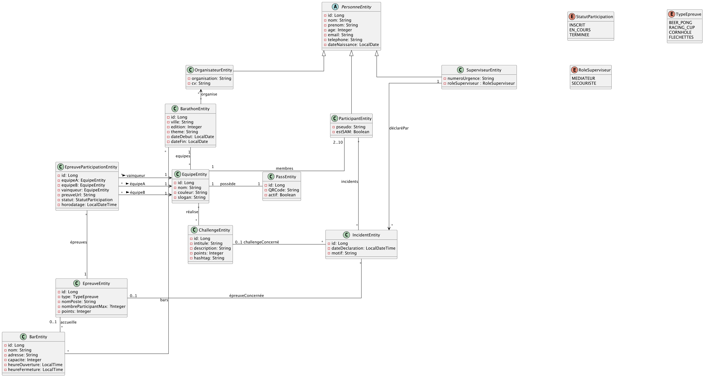

[](https://classroom.github.com/a/7dnCwqkd)
# <u>L3 Miage - VA - TP3 - <b style="color:red">noté</b></u>

* Dans ce TP vous avez une base de données H2. Pour ce connecter je vous laisse réferer au mode d'emploi dans les
  premiers TP de BDD

# Situation - 🍺 Barathon

Un barathon est une tournée des bars d'une ville, qui se déroule en équipe, au cours de laquelle
les participants peuvent obtenir des consommations gratuites, participer à des épreuves et compléter des challenges.

Vous faites partie de l'équipe chargée du développement d'une application Web permettant l'organisation et le
déroulement de Barathons. Votre architecte logiciel vous a fourni un diagramme UML des entités nécessaires à
l'application, que vous allez devoir implémenter.




Un Barathon se déroule dans une ville, et possède une édition (nombre entre 1 et N qui correspond au nombre de fois que
ce Barathon a été organisé dans cette ville). Il est articulé autour d'un thème central (Années 80, Jeux de mon enfance,
Fiesta Latina, etc.). Différents bars peuvent collaborer avec une édition du Barathon, pour qu'ils soient intégrés aux
épreuves, en contrepartie de quoi ils s'engagent à offrir des réductions et avantages aux participants. Chaque bar renseigne
son nom, son adresse, sa capacité maximum (nombre personnes maximum qu'il peut accueillir, intérieur et extérieur cumulés),
et ses horaires d'ouverture.

Un Barathon prévoit plusieurs types de personnes impliquées dans son déroulement. Chaque personne possède obligatoirement un
nom, prénom, une adresse email unique, numéro de téléphone unique à 10 chiffres, et une date de naissance.
* les participants, qui s'organisent en équipes pour participer au Barathon, sont inscrits sous un pseudo, et peuvent
  être un SAM (celui qui ne boit pas).
* les organisateurs sont tous les membres du personnel participant à l'organisation du Barathon. Ils font partie d'une organisation
  (un BDE, une asso étudiante, un syndicat de bars...), et renseignent leur CV.
* les superviseurs sont présents sur place durant tout le Barathon, et sont chargés du bon fonctionnement de ce dernier.
  Ils possèdent chacun un rôle (médiateur ou secouriste), ainsi qu'un numéro d'urgence unique, en plus de leur numéro de téléphone,
  qui peut être utilisé par les organisateurs ou par les participants en cas de besoin.

Chaque équipe est inscrite à un unique Barathon (pas de réutilisation d'équipes existantes pour une nouvelle édition d'un Barathon par exemple)
et comporte entre 2 et 10 participants, dont au moins un qui aura le rôle du SAM, celui qui ne boit pas pour
ramener ses collègues bourrés. Chaque équipe possède un nom unique, une couleur, et un score correspondant à la somme
des points des challenges et épreuves accomplis. Elle peut si elle le souhaite également choisir un slogan. Chaque équipe possède un Pass, identifié par un QR Code, pour
enregistrer sa participation aux épreuves et prouver son inscription au Barathon pour bénéficier des avantages et réductions.

Un Barathon propose deux types d'activités :
* les challenges sont à réaliser en équipe, n'importe où, et consistent en des défis de différentes natures à accomplir pour
  gagner des points (chanter et danser La Carioca, simuler une demande en mariage à un inconnu, rejouer une scène culte de Les bronzés font du ski, etc.).
  Chaque challenge possède un intitulé, une description, un nombre de points remportés en cas d'accomplissement, et un hashtag
  servant à prouver la réalisation du challenge en postant une story sur Instagram avec ce même hashtag.
* les épreuves se déroulent exclusivement dans les bars partenaires, entre 2 équipes (équipes A et B), dont l'une sort vainqueur.
  Une épreuve possède un type, un nombre de participants maximum non-optionnel, et un nombre de points. Chaque équipe peut participer plusieurs
  fois à une même épreuve jusqu'à sa réussite, pas forcément contre la même équipe adverse.

Une ParticipationEpreuve correspond à la participation de deux équipes à un épreuve. Elle comprend un statut (inscrit, en cours, et terminée, dans cet ordre),
un horodatage, les deux équipes A et B, et l'équipe vainqueur.

En cas de problème, les superviseurs peuvent déclarer des incidents, impliquant un ou plusieurs participants, en renseignant
une date de déclaration et un motif. Un incident peut également concerner une épreuve ou un challenge, mais pas obligatoirement.

#### ⚠️ Point d'attention

* Dans ce TP, nous partons du principe que les entités et les repositories sont implémentés, ainsi que quelques
  endpoints au complet.
* De plus vous avez toutes les exceptions et quelques méthodes déjà existantes utiles au test de correction (donc à ne
  pas supprimer)
* Ne modifiez pas les entrées existantes, recréer les 

## 🚧 À faire

### 🧪 Tests de l'existant

1. Tester les fonctions du component `SuperviseurComponent` sans mocker le repository.
2. Testez-les endpoints complètement (Component, Service, Controller) :
   * vérifier si toutes les équipes inscrites sont ok (`GET - /api/equipe/check`)
   * créer la participation à une épreuve (`POST - /api/epreuve/{id}`)

## 🛠️🧪 Documenter, implémenter et tester

Documenter, implémenter et tester au plus possible ces endpoints : 

### 1. Créer et ajouter d'un participant à une équipe

* Méthode : **PUT**
* lien : `/api/teams/{teamsName}/participants`
* Modèle d'entrée :
```json
{
  "nom": "toto",
  "prenom": "titi",
  "age": 18,
  "email": "toto@toto.com",
  "telephone": "+3378934567",
  "dateNaissance": "26/03/2026",
  "pseudo": "Le bruyant",
  "estSAM": false
}
```
* Modèle de sortie : 
```json
{
  "id": 0,
  "nom": "MyTeams",
  "couleur": "rouge",
  "slogan": "rouge c'est bien non ?",
  "participants": [
    {
      "nom": "toto",
      "prenom": "titi",
      "estSam": true
    },
    {
      "nom": "tato",
      "prenom": "tati",
      "estSam": false
    }

  ]
}
```
* Code de retours :
    * **201** :
        * le participant a bien été créé et ajouter à l'équipe.
    * **400** :
        * la requête d'entrée n'est pas conforme aux attentes pour la création d'un participant  
    * **404** :
        * L'équipe sur laquelle nous voulons ajouter un participant n'existe pas
    * **409** : 
        * Un participant avec les mêmes caractéristiques uniques existe déjà
    * **422** :
        * L'équipe devant accueillir le nouveau participant est déjà complète
    * ⚠️ pour le body de retour des erreurs
    ```json
        {
        "url": "/api/incidents/challenge/0",
        "error": "message en fonction"
        }
    ```
  

### 2. Permettre à un Bar de se désinscrire du Barathon

* Méthode : **DELETE**
* lien : `/barathon/{barathonId}/bars/{barId}`
* Modèle de sortie :
```json
{
  "id": 1, //Long
  "nom": "Bar", //String
  "adresse": "1 rue toto", //String
  "capacite": 120, //Integer
  "heureOuverture": "HH:mm:ss", //LocalTime
  "heureFermeture": "HH:mm:ss" //LocalTime 
}
```
* Code de retours :
    * **200w** :
        * Le bar a bien été supprimé de l'édition du Barathon
    * **404** :
        * Le Bar à supprimer n'existe pas
        * Le Barathon ou l'on veut supprimer un bar associé n'existe pas
    * **409** :
        * Un participant avec les mêmes caractéristiques uniques existe déjà
    * **422** :
        * Le bar à supprimer a déjà une participation à une épreuve

    * ⚠️ pour le body de retour des erreurs
    ```json
        {
        "url": "/barathon/1/bars/0",
        "error": "message en fonction"
        }
    ```

### 3. Rapporter un incident sur un challenge


* Méthode : **PUT**
* lien : `/api/incidents/challenge/{challengeId}`
* Modèle d'entrée :

```json
{
  "nom": "myTeams",
  "date": "2024-12-25T10:30:00",
  "motif": " le motif de l'incident"
}
```
* Modèle de sortie :
```json
{
  "intitule": "Le meilleur challenge",
  "description": "trop bien ce challenge",
  "points": 1,
  "hashtag": "#LeChallengeRelou",
  "equipes": [
    "myTeams"
  ] 
}
```
* Code de retours :
    * **201** :
        * L'incident a bien été créé, et 1 point leur a été enlever de leur challenge. 
    * **404** :
        * L'équipe sur laquelle nous voulons associer un incident n'existe pas
        * Le challenge sur lequel nous voulons associer un incident n'existe pas
    * **409** :
        * L'équipe sur laquelle nous voulons associer un incident n'est pas inscrite à ce challenge
    * **422** :
        * L'équipe devant accueillir le nouveau participant est déjà complète
    * ⚠️ pour le body de retour des erreurs
    ```json
        {
        "url": "/api/incidents/challenge/0",
        "error": "message en fonction"
        }
    ```


---

# <div style="text-align: center;">Fin de tp</div>
